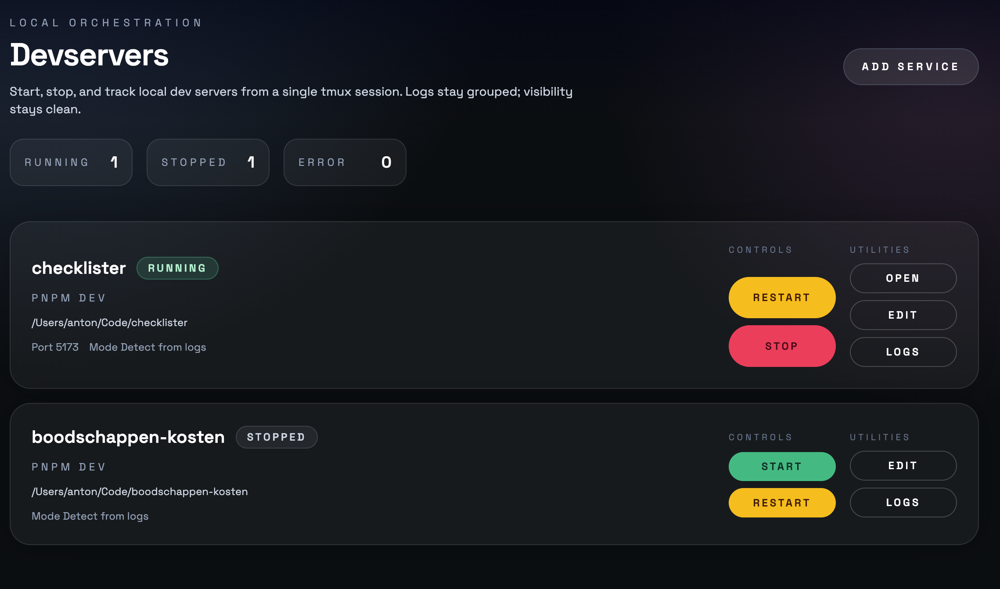

# Devservers Manager

Local dev server manager for macOS. Runs every service inside a single tmux session and gives you a UI + CLI to control them.

## Motivation

I started letting my AI agents manage dev servers, but they kept forgetting to turn them off. So I built a manager that shows all registered dev servers and can start/stop/restart them. With the skills you can simply say to your agent "Start dev server" or "Stop dev server" and it will work.

There are also some niceties like an "Open" button to open your local URL and log streaming from the tmux window. That way you never have to manage terminal windows to see logs from your dev servers.

## Screenshot



## Requirements

- macOS
- `tmux`
- Node.js 20+
- `pnpm`

## Install (recommended)

```
pnpm add -g @24letters/devservers
```

## Quickstart

Bootstrap the manager to verify everything is working:

```
devservers bootstrap
```

Then, install the skill to your AI agent of choice:

```
devservers install-skill --agent codex
# Switch agents by changing the name
devservers install-skill --agent claude
```

Open the UI:

```
http://127.0.0.1:4141/ui/
```

Add a service:

```
devservers add --name api --cwd /Users/you/Code/api --command "pnpm dev" --port 3000
```

Start/stop/restart:

```
devservers start api

devservers stop api

devservers restart api
```

## Config

Default config path (macOS):

```
~/Library/Application Support/Devservers Manager/devservers.json
```

Override with:

- `--config /path/to/devservers.json` (CLI or daemon)
- `DEVSERVER_CONFIG=/path/to/devservers.json`

Project-level compose support:
- Add project references in the UI (`Add Project`), each pointing to a repo path.
- If that repo has `devservers-compose.yml`, services are auto-loaded and watched for changes.

## Skills (Agents)

By default, skills install to `~/.<agent>/skills` (or `<AGENT>_HOME/skills` if set). Use `--dest` to override.

Install all bundled skills for Codex (default):

```
devservers install-skill
```

Install for a different agent:

```
devservers install-skill --agent claude
```

Install a single skill:

```
devservers install-skill devservers-register-service
```

Switch between agents by re-running with a new `--agent` value:

```
devservers install-skill --agent codex
devservers install-skill --agent cursor
```

Set a custom skills directory:

```
devservers install-skill --dest /path/to/skills
```

## From source (development)

```
pnpm install
```

Start the dev daemon + UI (Vite):

```
pnpm run bootstrap
```

Dev UI:

```
http://127.0.0.1:4142/
```

## Docs

- `docs/BOOTSTRAP.md`
- `docs/CONFIG.md`
- `docs/CLI.md`
- `docs/DAEMON.md`
- `docs/ARCHITECTURE.md`
- `docs/TROUBLESHOOTING.md`

Some of the scripts in this repo are copied from Steipete's excellent agent-scripts repository, see the license in the scripts folder.

## License

MIT
